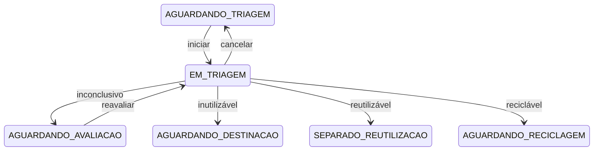

# ADR-006 — Triagem configurável e máquina de estados central

- Status: aceito
- Data: 2026-08-12

## Contexto

Perguntas e classificações de triagem podem variar entre instituições. Ao mesmo tempo, o status de
um equipamento não pode mudar arbitrariamente nem perder o histórico da decisão.

## Decisão

Persistir critérios, tipos de resposta, opções e classificações como catálogos configuráveis. Cada
execução cria uma `Triage` e respostas imutavelmente vinculadas aos critérios usados. Transições são
validadas em `equipment/workflow.py`; endpoints apenas coordenam os serviços.

## Consequências

Novas perguntas e classificações não exigem alteração no frontend ou no esquema. Toda conclusão
atualiza equipamento, triagem, eventos e auditoria em uma única transação. Novos estados ainda
exigem uma decisão explícita na política, evitando saltos operacionais indevidos.
