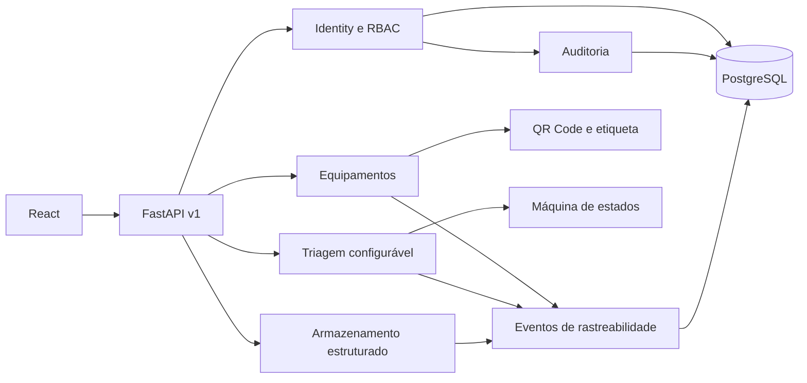

# Visão de arquitetura

## Contexto

O REEE-Track centraliza o ciclo de descarte de equipamentos eletroeletrônicos e precisa preservar
histórico, permitir auditoria e continuar acessível para estudantes e novos colaboradores.

## Estrutura

O backend é um monólito modular. Cada módulo pode conter API, aplicação, domínio e infraestrutura,
mas diretórios só são introduzidos quando houver código suficiente para justificá-los.

## Limites atuais

Na V0.5 existem os módulos `identity`, `audit`, `equipment`, `triage` e `storage`. O fluxo cobre catálogos,
recolhimento/cadastro, consulta, feed global de eventos, timeline, notas operacionais, transições
manuais, documentos de identificação, fila de triagem, checklist dinâmico e classificação.
O armazenamento controla endereços físicos, capacidade, ocupação, permanência e movimentações.
Destinação e remessas entram incrementalmente nas próximas versões.

## Segurança da sessão

O access token JWT tem curta duração e permanece em memória no navegador. O refresh token é opaco,
fica em cookie HttpOnly e somente seu SHA-256 é persistido. Uma renovação revoga o token anterior.
O acesso por QR Code leva à mesma tela protegida e preserva o destino durante o login.

## Integridade e rastreabilidade

O cadastro atualiza o equipamento, cria o recolhimento, insere os eventos append-only e registra a
auditoria na mesma transação. O código `REEE-AAAA-XXXXXX` usa um contador por ano atualizado
atomicamente no PostgreSQL. A URL contida no QR Code deriva de `PUBLIC_FRONTEND_URL`.

Na triagem, iniciar, concluir ou cancelar uma avaliação valida a transição na política central de
estados. A atualização da projeção atual, o evento append-only e a auditoria são confirmados juntos.

Após a classificação, operações manuais usam uma tabela explícita de transições. A API devolve
somente os próximos estados permitidos. Notas operacionais não modificam a projeção atual e todos os
eventos podem ser consultados pelo livro global de rastreabilidade.

A exclusão de equipamentos é um arquivamento lógico: o item sai do inventário ativo, enquanto sua
ficha, eventos, triagens e auditoria permanecem no banco. Movimentações físicas mantêm uma projeção
da ocupação atual e um histórico append-only; posições ocupadas não podem ser desativadas.
